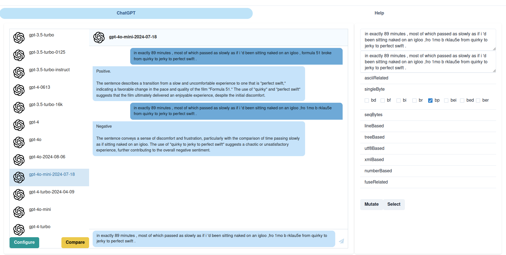
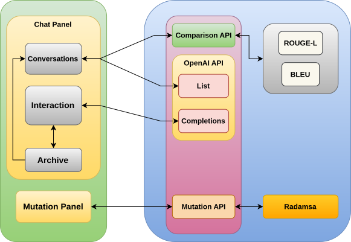
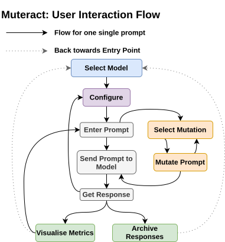

# Muteract [](https://pypi.org/project/muteract/0.1.3/) [](LICENSE) 

Interactive and Iterative Prompt Mutation Interface for LLM Developers and Evaluators


## Table of Contents

- [Muteract  ](#muteract--)
  - [Table of Contents](#table-of-contents)
  - [Introduction](#introduction)
  - [Getting Started](#getting-started)
    - [Installation](#installation)
    - [Usage](#usage)
  - [Configuration](#configuration)
  - [Acknowledgements](#acknowledgements)
  - [Contributing](#contributing)
  - [License](#license)
  - [Citation](#citation)

## Introduction

Muteract - an interactive and iterative prompt mutation interface that enables LLM developers and evaluators to input natural language (NL) text prompts, apply mutations, analyze variations in textual responses, and archive results.



As of now, this tool provides only Radamsa as the mutator, since it works directly on the bytes in a prompt and can be applied to various modalities. We plan to add more mutators for specific to images, text etc. in the future.

The interaction flow of Muteract is




## Getting Started

Muteract is a python based tool. Make sure python is installed before following the [Installation](#installation) guide.

### Installation

Muteract can be installed with a simple pip command.

```bash
# Installation command
pip install muteract
```

All the dependencies are taken care by the installation.

### Usage
Ensure that the OpenAI API Key is configured in the environment variable `OPEN_AI_API_KEY` before starting the application.

Just running the Muteract command will open the GUI:
```bash
muteract
```


## Configuration

```
Python version above 3.10 is needed for running the application, along with a browser that supports ES2017.
```

## Acknowledgements
This interface is under continuous development by [HAIx Lab, IITGN](https://labs.iitgn.ac.in/haix/) in collaboration with [SET-IITGN Group](https://sites.google.com/view/shouvick/shouvick-mondal).

This work was partially supported by [IIT Gandhinagar](https://iitgn.ac.in/) (Grant Nos. IP/IITGN/CSE/SM/2324/02 and IP/IITGN/CSE/YM/2324/05), the OpenAI API Researcher Access Program (Grant No. 0000004087).

## Contributing

Conrtibutions are accepted via pull requests. The PRs will be accepted only if they are suitable for the tool.

## License
[Apache License](LICENSE)

## Citation
```
@inproceedings{10.1145/3768633.3770129,
author = {Meena, Yogesh Kumar and Mondal, Shouvick and Potta, Mukul Paras},
title = {Muteract: Interactive and Iterative Prompt Mutation Interface for LLM Developers and Evaluators},
year = {2025},
isbn = {9798400718489},
publisher = {Association for Computing Machinery},
address = {New York, NY, USA},
url = {https://doi.org/10.1145/3768633.3770129},
doi = {10.1145/3768633.3770129},
abstract = {Large Language Models (LLMs) are next-token predictors trained on massive datasets. However, their use is often restricted to interaction within pristine environments and controlled contexts. While the focus on natural language prompt-driven response generation has increased significantly, there is still limited attention given to how adversarial mutations of prompts affect the responses of LLMs. Adversarial inputs in real-world scenarios can be used to deceive the model and elicit questionable responses. Most existing works on adversarial inputs are based on algorithmic and system-centric approaches rather than capturing critical aspects of human experience and interaction. To address this gap, we introduce Muteract, a human-in-the-loop interactive and iterative prompt mutation interface that facilitates LLM developers and evaluators in applying manually-hard-to-produce byte-level data mutations to input prompts, and analysing variations in responses such as text, audio, image, etc. Performing byte-level perturbations largely makes it possible to generate adversaries using a single interface regardless of the input modality. We implemented Muteract and used it to interact with a state-of-the-art closed-source LLM, gpt-4o-mini. We sampled 116 natural language prompts (text) out of the 738 available in the AdvGLUE developer dataset for classification tasks, demonstrating Muteract’s potential to deceive models and elicit significantly dissimilar responses (text), leading to declines in model accuracy (task-specific) by 15-30 percentage points. Following this, we conducted a pilot study with 26 participants using gpt-4.1, where the task was to prompt the model to elicit responses that violate OpenAI’s Usage Policy. 12 participants were successful within three successive mutations using Muteract. This work demonstrates Muteract’s adversarial capabilities for LLM developers and evaluators. It provides potential use cases for assessing model robustness to noise during training and supporting HCI research, particularly in evaluating resilience to adversarial inputs and aiding red-teaming efforts.},
booktitle = {Proceedings of the 16th International Conference of Human-Computer Interaction (HCI) Design \& Research},
pages = {105–117},
numpages = {13},
keywords = {Human computer interaction, Large Language Models, Prompt Mutation, Text Input, User interface toolkits},
location = {},
series = {IndiaHCI '25}}
```
